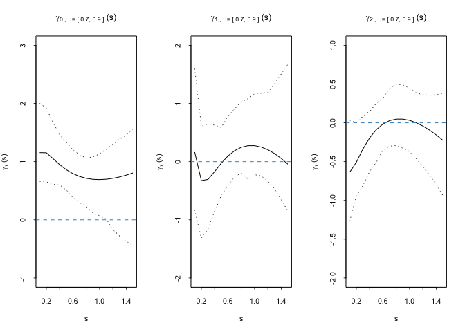
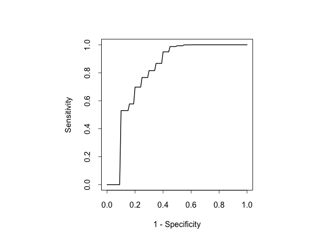

    remotes::install_github("Xiaona923/pkg_test", force = TRUE)

    ## cpp11    (0.5.1  -> 0.5.2 ) [CRAN]
    ## utf8     (1.2.5  -> 1.2.6 ) [CRAN]
    ## pillar   (1.10.2 -> 1.11.1) [CRAN]
    ## magrittr (2.0.3  -> 2.0.4 ) [CRAN]
    ## isoband  (0.2.7  -> 0.3.0 ) [CRAN]
    ## tibble   (3.2.1  -> 3.3.0 ) [CRAN]
    ## ggplot2  (3.5.2  -> 4.0.1 ) [CRAN]

    ## 
    ## The downloaded binary packages are in
    ##  /var/folders/xf/l79029316mxg61sybqflzb_40000gn/T//Rtmp1pjvLj/downloaded_packages
    ## ── R CMD build ─────────────────────────────────────────────────────────────────
    ##      checking for file ‘/private/var/folders/xf/l79029316mxg61sybqflzb_40000gn/T/Rtmp1pjvLj/remotes935817f537ce/Xiaona923-pkg_test-0020d28/DESCRIPTION’ ...  ✔  checking for file ‘/private/var/folders/xf/l79029316mxg61sybqflzb_40000gn/T/Rtmp1pjvLj/remotes935817f537ce/Xiaona923-pkg_test-0020d28/DESCRIPTION’
    ##   ─  preparing ‘lsurvROC’:
    ##      checking DESCRIPTION meta-information ...  ✔  checking DESCRIPTION meta-information
    ##   ─  checking for LF line-endings in source and make files and shell scripts
    ##   ─  checking for empty or unneeded directories
    ##   ─  building ‘lsurvROC_0.0.1.tar.gz’
    ##      
    ## 

    library(lsurvROC)

## Introduction

We propose a flexible regression framework to evaluate the prognostic
capability of longitudinal biomarker with survival outcome accounting
for the covariate and biomaker measurement time. Here is an example
using a simulated dataset to estimate the biomarker threshold at a
specified specificity level along with the corresponding sensitivity,
and to construct a covariate- and measurement time-specific ROC curve.

## Read in example data

    data("example_data")

## Estimate time-varying coefficients

-   dat.long: long format data, each subject may have multiple biomarker
    records
-   dat.short: short format data, each subject only has one record,
    including observed event time, event indicator, covariates (eg. Z,
    Zcont in this example)
-   cutoff.type.basis: type of basis function to estimate biomarker
    threshold, (FP: Fractional polynomial, BS: B Splines, linear: linear
    basis)
-   sens.type.basis: type of basis function to estimate sensitivity
    level, (FP: Fractional polynomial, BS: B Splines, linear: linear
    basis)
-   covariate1: a vector of covariate names to estimate the biomarker
    threshold
-   covariate2: a vector of covariate names to estimate the sensitivity
    level
-   tau: target specificity level, could be a single value or a set of
    values between 0 and 1
-   time.window: a time window for biomarker evaluation
-   nResap: number of perturbation resampling

<!-- -->

    res = lsurvROC(dat.long = example_data$data.long, 
                  dat.short = example_data$data.short,
                  cutoff.type.basis = "FP",
                  sens.type.basis = "FP", 
                  covariate1 = c("Z", "Zcont"), 
                  covariate2 = c("Z", "Zcont"), 
                  tau = c(0.7, 0.8, 0.9), 
                  time.window = 1, 
                  nResap = 50,
                  newdata = NULL
                  )

    par(mfrow=c(1,3))
    plot(res)

## Conditional ROC curve

    res = lsurvROC(dat.long = example_data$data.long, 
                  dat.short = example_data$data.short,
                  cutoff.type.basis = "FP",
                  sens.type.basis = "FP", 
                  covariate1 = c("Z", "Zcont"), 
                  covariate2 = c("Z", "Zcont"), 
                  tau = seq(0.1, 0.9, 0.05), 
                  time.window = 1, 
                  nResap = 50,
                  newdata = data.frame(vtime = 0.5, Z = 1, Zcont = 0.25)
                  )

    plot(res, ROC = TRUE)

